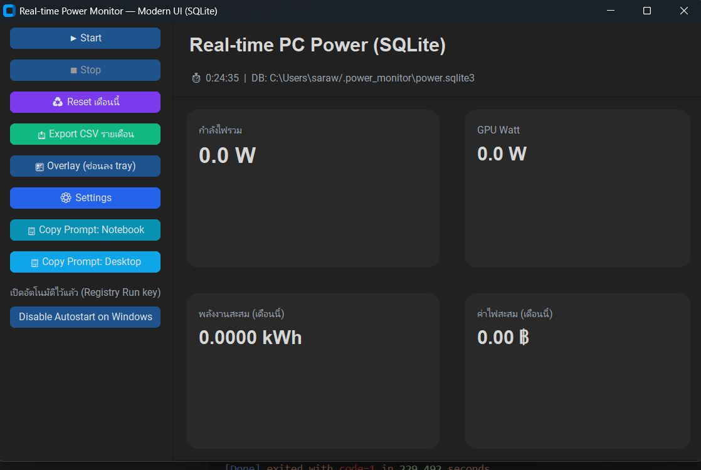

# Real-time Power Monitor — Modern UI (SQLite)

Modern Tkinter app (CustomTkinter) สำหรับประมาณกำลังไฟ/พลังงาน (kWh) แบบเรียลไทม์
รองรับ **Overlay**, **Tray**, **Autostart (Windows Registry)** และ **สรุปเป็นรายวัน (SQLite)**
ไม่รองรับ GPU AMD


## Features
- Real-time watts, kWh, cost
- GPU watt ผ่าน NVML (`nvidia-ml-py`) หรือ `nvidia-smi` (fallback)
- Rollover รายวัน → สรุปลง `daily_summary` และลบ samples ของเมื่อวาน
- Export รายเดือนเป็น CSV (เฉพาะเดือนที่มีข้อมูล)
- Overlay ลอยบนหน้าจอ + ย่อไป Tray
- Autostart บน Windows (HKCU\...\Run)
- **Settings UI + config.json** ปรับค่าได้ ไม่ต้องแก้โค้ด
- ปุ่ม **Copy Prompt** สอบถามสเปก (Notebook/Desktop)

## Requirements
- Windows 10/11 (ทดสอบหลักบน Windows)
- Python 3.10+
- NVIDIA GPU (ถ้าต้องการอ่าน GPU watt จริง, ไม่บังคับ)
- `nvidia-smi` กลับมาให้ด้วยเมื่อมีไดรเวอร์ NVIDIA

## Install
```bash
python -m venv .venv
.venv\Scripts\activate
pip install -r requirements.txt


